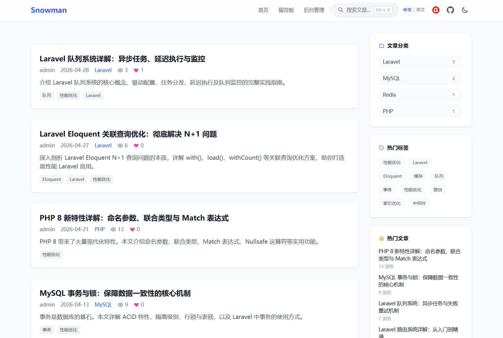
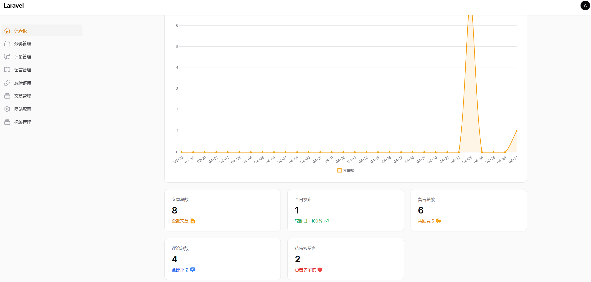

# SnowmanBlog

一个基于 Laravel 12 + Filament v3 构建的开源个人博客系统，包含完整的前端展示与后台管理功能。

[](https://php.net)
[](https://laravel.com)
[](https://filamentphp.com)
[](https://github.com/SnowmanNunu/SnowmanBlog/actions/workflows/ci.yml)
[](phpstan.neon)
[](https://laravel.com/docs/12.x/pint)
[](LICENSE)

## 在线预览

- 博客首页：https://blog.snowmannunu.top
- 后台管理：https://blog.snowmannunu.top/admin

## 功能特性

### 前端展示
- 文章列表与分页浏览
- 文章详情页（支持封面图、分类、标签、SEO Meta 自定义）
- 文章上一篇 / 下一篇导航
- 相关文章推荐
- 文章分类与标签筛选
- 全局实时搜索（`Ctrl + K` 唤起，支持标题/内容/摘要搜索，关键词高亮）
- 留言板（访客可发表留言，博主可在后台回复）
- 文章评论系统（支持嵌套回复、邮件通知）
- 文章点赞功能
- Sitemap 站点地图（`/sitemap.xml`）
- RSS 订阅（`/rss.xml`）
- 响应式设计，适配桌面端与移动端
- 暗黑模式支持

### 后台管理
- **文章管理** — 发布、编辑、草稿、封面图上传、SEO 设置、定时发布
- **分类管理** — 文章分类的增删改查
- **标签管理** — 文章标签的增删改查
- **留言管理** — 审核留言、博主回复
- **评论管理** — 审核评论、回复评论、邮件通知开关
- **友链管理** — 友情链接的增删改查与排序
- **站点设置** — 博客标题、描述、ICP 备案号、管理员邮箱等基础配置
- **存储设置** — 可视化切换本地磁盘 / 阿里云 OSS / 腾讯云 COS / 七牛云 / AWS S3，无需修改 `.env`
- **缓存管理** — 一键清除应用缓存、视图缓存、配置缓存
- **备份管理** — 数据库备份与下载

## 项目截图

### 前台首页



### 后台管理



## 技术栈

| 层级 | 技术 |
|------|------|
| 后端框架 | Laravel 12.x (PHP 8.2+) |
| 后台面板 | Filament v3 |
| 数据库 | MySQL 5.7+ / SQLite |
| 前端模板 | Blade |
| CSS 框架 | Tailwind CSS 4.x (CDN) |
| JS 交互 | Alpine.js (CDN) |
| 构建工具 | Vite |
| Markdown | league/commonmark |

## 安装教程

### 环境要求

- PHP >= 8.2
- Composer
- MySQL 5.7+ 或 SQLite
- Node.js >= 18 + npm
- Nginx 或 Apache（生产环境）
- Redis（可选，用于缓存/队列）

### 1. 克隆代码

```bash
git clone https://github.com/SnowmanNunu/SnowmanBlog.git
cd SnowmanBlog
```

### 2. 安装 PHP 依赖

```bash
composer install --no-dev --optimize-autoloader
```

本地开发可去掉 `--no-dev`：

```bash
composer install
```

### 3. 安装前端依赖

```bash
npm install
npm run build
```

### 4. 环境配置

```bash
cp .env.example .env
php artisan key:generate
```

编辑 `.env` 文件，配置数据库连接：

```env
APP_NAME=SnowmanBlog
APP_URL=https://your-domain.com
APP_LOCALE=zh_CN
APP_FALLBACK_LOCALE=zh_CN
APP_FAKER_LOCALE=zh_CN

# MySQL 配置示例
DB_CONNECTION=mysql
DB_HOST=127.0.0.1
DB_PORT=3306
DB_DATABASE=snowmanblog
DB_USERNAME=root
DB_PASSWORD=your_password

# SQLite 配置示例（本地测试）
# DB_CONNECTION=sqlite
# DB_DATABASE=/absolute/path/to/database.sqlite
```

### 5. 创建数据库（MySQL）

```bash
mysql -u root -p -e "CREATE DATABASE snowmanblog CHARACTER SET utf8mb4 COLLATE utf8mb4_unicode_ci;"
```

### 6. 运行数据库迁移

```bash
php artisan migrate
```

### 7. 填充演示数据（可选）

一键生成包含文章、分类、标签、评论、留言、友链的演示数据，方便快速体验：

```bash
php artisan db:seed
```

> **提示**：演示数据会创建一个默认管理员账号 `admin@example.com`，密码 `password`。安装完成后请立即修改密码。

### 8. 创建存储软链接

```bash
php artisan storage:link
```

### 9. 创建后台管理员账号（如未执行 db:seed）

```bash
php artisan tinker
```

在 tinker 中执行：

```php
App\Models\User::create([
    'name' => 'Admin',
    'email' => 'admin@example.com',
    'password' => bcrypt('your_password'),
]);
```

退出 tinker：`exit`

### 10. 配置定时任务（文章定时发布）

将以下命令添加到系统的 crontab 中：

```bash
* * * * * cd /path/to/SnowmanBlog && php artisan schedule:run >> /dev/null 2>&1
```

### 11. 配置邮件（可选，用于评论邮件通知）

如需开启评论邮件通知，在 `.env` 中配置 SMTP：

```env
MAIL_MAILER=smtp
MAIL_SCHEME=smtp
MAIL_HOST=smtp.qq.com
MAIL_PORT=465
MAIL_USERNAME=your_email@qq.com
MAIL_PASSWORD=your_smtp_auth_code
MAIL_ENCRYPTION=ssl
MAIL_FROM_ADDRESS=your_email@qq.com
MAIL_FROM_NAME=SnowmanBlog
```

然后在后台 **设置管理** 中配置 `admin_email` 为接收通知的邮箱地址。

### 12. 配置队列（可选，用于异步发送邮件）

如需使用数据库队列处理邮件发送，在 `.env` 中确认：

```env
QUEUE_CONNECTION=database
```

并启动队列监听器：

```bash
php artisan queue:listen
```

生产环境建议使用 Supervisor 管理队列进程。

### 13. 配置 Web 服务器

#### Nginx 配置示例

```nginx
server {
    listen 80;
    server_name your-domain.com;
    root /path/to/SnowmanBlog/public;
    index index.php index.html;

    location / {
        try_files $uri $uri/ /index.php?$query_string;
    }

    location ~ \.php$ {
        fastcgi_pass 127.0.0.1:9000;
        fastcgi_index index.php;
        fastcgi_param SCRIPT_FILENAME $realpath_root$fastcgi_script_name;
        include fastcgi_params;
    }

    location ~ /\.(?!well-known).* {
        deny all;
    }
}
```

### 14. 目录权限

确保以下目录 Web 服务器可写：

```bash
chmod -R 755 storage bootstrap/cache
chown -R www-data:www-data storage bootstrap/cache
```

### 15. 完成

访问 `http://your-domain.com` 查看博客首页，访问 `http://your-domain.com/admin` 进入后台管理面板。

如果执行了 `db:seed`，使用以下账号登录：
- 邮箱：`admin@example.com`
- 密码：`password`

---

## Docker 部署

本项目提供完整的 Docker 支持，一键启动包含 PHP-FPM、Nginx、MySQL、Redis 的全栈环境。

### 环境要求

- Docker >= 20.10
- Docker Compose >= 2.0

### 1. 克隆代码

```bash
git clone https://github.com/SnowmanNunu/SnowmanBlog.git
cd SnowmanBlog
```

### 2. 启动容器

```bash
docker-compose up -d
```

首次启动会自动完成：
- 安装 Composer 依赖
- 生成应用密钥
- 运行数据库迁移
- 创建存储软链接
- 生成配置 / 路由 / 视图缓存

### 3. 填充演示数据（可选）

```bash
docker-compose exec app php artisan db:seed
```

### 4. 创建管理员账号（如未执行 db:seed）

```bash
docker-compose exec app php artisan tinker
```

在 tinker 中执行：

```php
App\Models\User::create([
    'name' => 'Admin',
    'email' => 'admin@example.com',
    'password' => bcrypt('your_password'),
]);
```

### 5. 访问应用

- 博客首页：http://localhost:8080
- 后台管理：http://localhost:8080/admin

如果执行了 `db:seed`，使用以下账号登录：
- 邮箱：`admin@example.com`
- 密码：`password`

### 6. 常用命令

```bash
# 查看容器状态
docker-compose ps

# 查看应用日志
docker-compose logs -f app

# 进入应用容器
docker-compose exec app sh

# 重启服务
docker-compose restart

# 停止并移除容器
docker-compose down

# 重建镜像（代码变更后）
docker-compose up -d --build
```

### 7. 容器架构

| 容器 | 服务 | 端口 | 说明 |
|------|------|------|------|
| `snowmanblog-app` | PHP-FPM + Supervisor | — | 主应用、队列 Worker |
| `snowmanblog-web` | Nginx | `8080` | Web 入口 |
| `snowmanblog-db` | MySQL 8.0 | `3306` | 数据库 |
| `snowmanblog-redis` | Redis | `6379` | 缓存 / 队列 |
| `snowmanblog-scheduler` | Cron | — | 定时任务调度 |

---

## 云存储配置

SnowmanBlog 支持在后台直接切换图片存储位置，无需修改代码或 `.env` 文件：

1. 进入后台 **存储设置** 页面（`/admin/storage-settings`）
2. 选择存储驱动：本地磁盘 / 阿里云 OSS / 腾讯云 COS / 七牛云 / AWS S3
3. 填写对应云存储的 Access Key、Bucket、Endpoint 等参数
4. 点击保存，配置立即生效

新上传的封面图和文章内嵌图片将自动保存到所选存储。前台图片 URL 会自动适配对应的 CDN 域名。

> 注意：切换存储驱动不会影响已上传的历史图片。如需迁移已有图片，请手动同步到新的存储桶。

---

## 项目结构

```
SnowmanBlog/
├── app/
│   ├── Console/Commands/         # Artisan 命令（如定时发布文章）
│   ├── Filament/Resources/       # Filament 后台资源
│   ├── Filament/Pages/           # Filament 自定义页面（缓存、备份、存储设置）
│   ├── Http/Controllers/         # 前端控制器
│   ├── Mail/                     # 邮件类
│   ├── Models/                   # Eloquent 模型
│   └── Providers/                # 服务提供者
├── database/migrations/          # 数据库迁移文件
├── database/seeders/             # 数据库种子（含演示数据）
├── resources/views/              # Blade 模板
├── routes/web.php                # Web 路由
└── public/                       # 入口目录
```

## 开发说明

本项目采用简洁的架构设计，便于扩展与维护。关键设计决策：

- **设置存储**：使用 `settings` 表（key-value 结构）存储站点配置，通过 `Setting::get('key')` 读取
- **视图共享**：在 `ViewComposerServiceProvider` 中全局注入站点标题、描述等变量
- **定时发布**：利用 Laravel Schedule + Cron，每分钟检查并发布到期文章
- **邮件通知**：评论提交时自动发送邮件给管理员，仅对访客评论生效
- **云存储抽象**：通过 `media_url()` 助手函数统一处理本地和云存储图片 URL，切换存储驱动对业务代码无侵入

## 更新日志

详见 [CHANGELOG.md](./CHANGELOG.md) 与 [roadmap.md](./roadmap.md)

## License

MIT License
